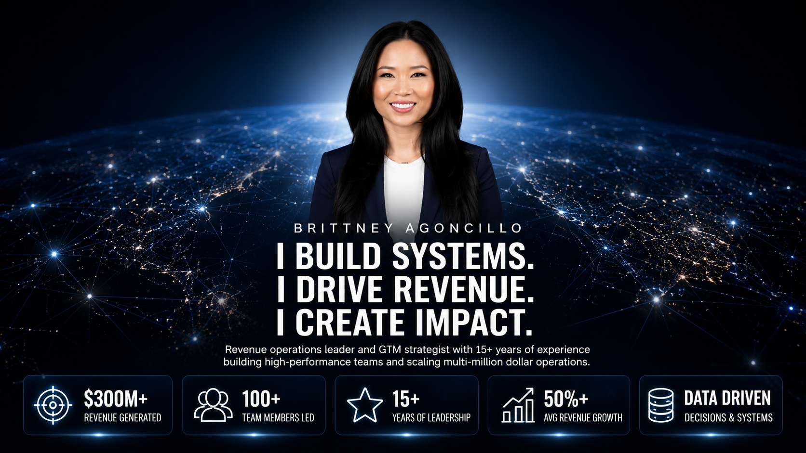

 

# I BUILD SYSTEMS.  
# I DRIVE REVENUE.  
# I CREATE IMPACT.

### Revenue Operations • GTM Strategy • Business Intelligence • Brand Growth

 

<table>
<tr>
<td align="center"><strong>$300M+</strong> Revenue Generated</td>
<td align="center"><strong>100+</strong> Team Members Led</td>
<td align="center"><strong>15+</strong> Years Leadership</td>
<td align="center"><strong>50%+</strong> Revenue Growth Delivered</td>
<td align="center"><strong>Data Driven</strong> Forecasting, KPI & Execution Systems</td>
</tr>
</table>

 

---

## THE CBI OPERATING SYSTEM™

A proven framework for building scalable revenue engines.

| 01 AUDIT | 02 DIAGNOSE | 03 OPTIMIZE | 04 SCALE | 05 SUSTAIN |
|---|---|---|---|---|
| Assess performance, systems, and data gaps. | Identify root causes and high-impact opportunities. | Design and implement data-driven systems. | Execute strategies that accelerate revenue growth. | Monitor, refine, and build systems that last. |

---

## LIVE REVENUE INTELLIGENCE

<table>
<tr>
<td align="center">

### 🔴 SYSTEM ACTIVE

# $300M+  
### in Revenue Generated

**Real-time revenue intelligence across operations, GTM execution, retail growth, team enablement, and brand performance.**

 

`Retail Operations` • `Revenue Systems` • `GTM Execution` • `Market Expansion` • `Brand Growth`

</td>
</tr>
</table>

> Note: GitHub README does not support live JavaScript counters. For a true live counter, this section should be built into a GitHub Pages site or embedded as an animated SVG.

---

## SELECTED WORK

| Project | Focus | Impact |
|---|---|---|
| **Revenue Operations Command Center** | Forecasting, KPI dashboards, executive reporting | Built systems for clarity, accountability, and growth |
| **Cannabis Retail Growth Systems** | Retail operations, customer experience, sales execution | Scaled high-volume cannabis retail performance |
| **GTM Execution Playbook** | Campaign execution, market positioning, launch systems | Connected strategy to measurable revenue action |
| **Executive KPI Dashboard Framework** | Dashboards, reporting systems, leadership visibility | Improved decision-making and operational rhythm |
| **Delivery Operations Optimization** | Logistics, SLA adherence, customer experience | Increased speed, consistency, and service reliability |

---

## INSIGHTS, PRESS & PUBLICATIONS

| Feature | Category | Link |
|---|---|---|
| **PR%F Awards Journal** | Executive Judge Spotlight | Read Feature → |
| **Vegas Cannabis Magazine** | Industry Feature | Read Article → |
| **UC Riverside Speaker Series** | Speaking & Education | View Feature → |
| **Nevada Cannabis Awards** | Awards & Recognition | View Feature → |
| **Women in Cannabis Feature** | Leadership & Industry Growth | Read Feature → |

---

## MEDIA & SPEAKING

| Brand Activations | Speaking | Industry Recognition |
|---|---|---|
| Celebrity walkthroughs and cultural partnerships | University lectures, panels, and cannabis education | Awards, publications, judging, and executive features |

---

## TRUSTED BY / WORKED WITH

---

## CORE EXPERTISE

- Revenue Operations & Strategy  
- GTM Strategy & Execution  
- Sales and Pipeline Optimization  
- Marketing Strategy & Brand Growth  
- Data Analytics & KPI Reporting  
- Team Leadership & Enablement  
- Systems & Process Optimization  
- Customer Experience & Retention  
- Executive Reporting  
- Business Development  

---

## TECH, TOOLS & SYSTEMS

`Salesforce` `HubSpot` `Power BI` `Tableau` `Excel` `Looker` `SQL` `Python` `Notion` `Google Sheets` `Miro` `Figma`

---

## THE PHILOSOPHY

> I build systems that transform growth into predictable revenue.

## GREAT OPERATORS SOLVE TODAY’S PROBLEMS.  
## GREAT LEADERS BUILD SYSTEMS THAT SCALE TOMORROW.

 

